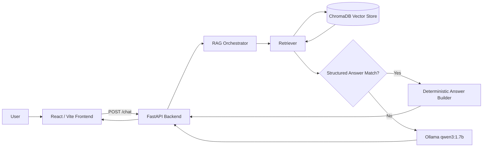
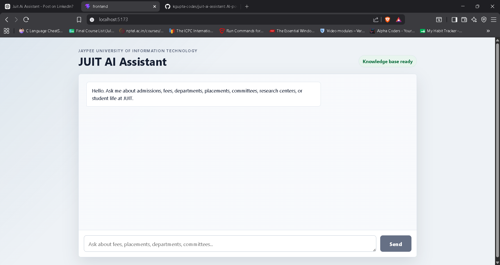
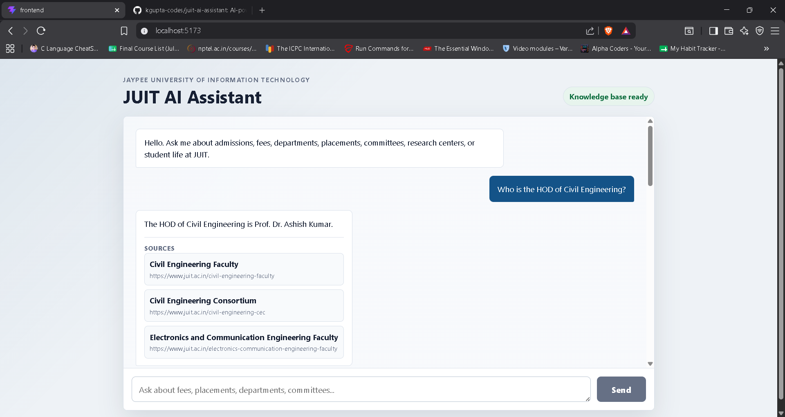
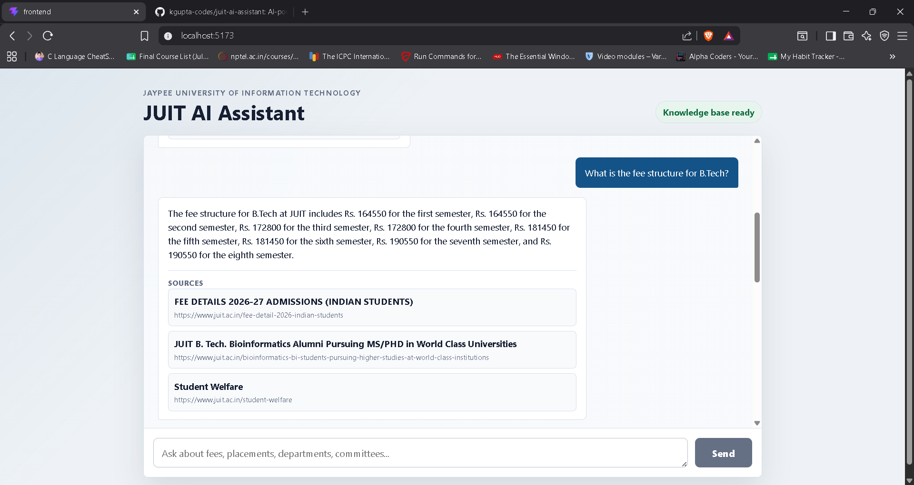
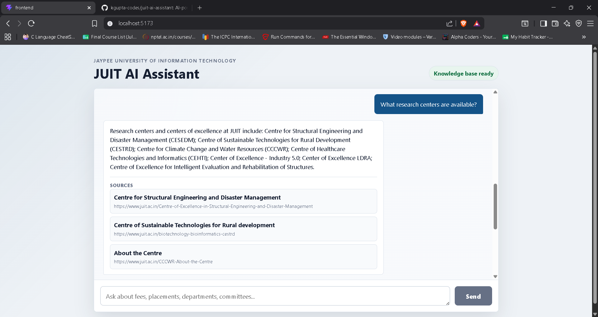
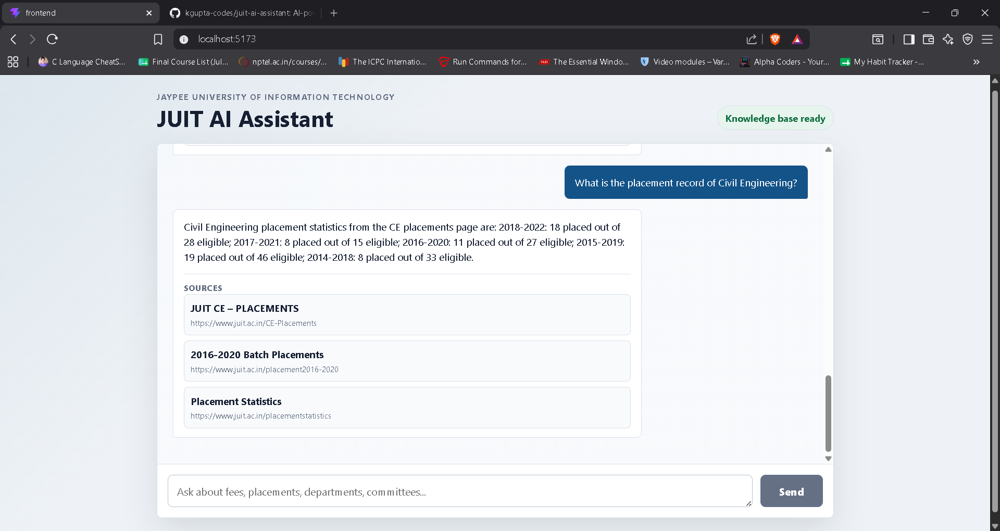

# JUIT AI Assistant

An AI chatbot for Jaypee University of Information Technology (JUIT), Waknaghat. The assistant answers questions about admissions, fees, departments, HODs, placements, committees, research centers, clubs, and other university information using a local retrieval-augmented generation pipeline.

The project is built as a portfolio-ready full-stack RAG application: a React/Vite chat frontend, a FastAPI backend, ChromaDB vector retrieval, structured answer rules for high-value queries, and Ollama-powered local generation.

## Features

- Chatbot UI for asking natural-language JUIT questions.
- FastAPI backend with `/chat` and `/search` endpoints.
- ChromaDB-backed retrieval over scraped JUIT website content.
- Structured answers for known high-signal query types, including HOD, fees, committees, research centers, placements, and student clubs.
- Source metadata returned with answers for traceability.
- Stable benchmark suite with `12/12 PASSED`.
- Docker Compose setup for frontend, backend, ChromaDB volume mount, and Ollama.
- Deployment guidance for Vercel, Render, Railway, VPS, and local Ollama-based hosting.

## Architecture



## Tech Stack

- Frontend: React, Vite, CSS
- Backend: FastAPI, Uvicorn, Pydantic
- Retrieval: ChromaDB, sentence-transformers `all-MiniLM-L6-v2`
- Generation: Ollama with `qwen3:1.7b`
- Data pipeline: Python scraper, local JSON corpus, ChromaDB persistent store
- Deployment: Docker, Docker Compose, Vercel, Render, Railway, VPS-compatible backend hosting

## Retrieval Pipeline

1. JUIT website pages are scraped into `data/pages/` as structured JSON.
2. Ingestion chunks page content and stores embeddings in a persistent ChromaDB collection.
3. The backend retrieves candidate documents from ChromaDB for a user query.
4. Query-specific ranking and structured routes identify high-value institutional answers.
5. Structured answer handlers return deterministic responses for known categories.
6. General questions are answered by Ollama using retrieved context only.
7. The API returns the answer plus source metadata for the frontend.

The retrieval architecture is intentionally stable. Deployment work should not change retriever ranking, HOD extraction, benchmark expectations, ChromaDB contents, or structured answer behavior without rerunning validation.

## Benchmark Results

Stable benchmark command:

```bash
python benchmark_runner.py
```

Current expected result:

```text
Result: 12/12 PASSED
```

The benchmark writes `benchmark_report.md` and exits non-zero if any required answer or source terms are missing.

## Screenshots

Screenshots should come from the running application only. Do not use mockups or fabricated images.

### Home Page


Landing view of the JUIT AI Assistant chat interface.

### HOD Query


Example answer for a Civil Engineering HOD question.

### Fee Query


Example answer for a B.Tech fee structure question.

### Research Centers Query


Example answer listing JUIT research centers and centers of excellence.

### Placement Query


Example answer for a placement-related query.

## Local Setup

### Prerequisites

- Python 3.12 recommended
- Node.js 22 recommended
- Ollama installed locally
- ChromaDB directory restored at `chroma_db/`

### Backend

```bash
python -m venv venv
source venv/bin/activate
pip install -r requirements.txt
python -m uvicorn backend.app.main:app --host 127.0.0.1 --port 8000
```

Backend environment variables:

```text
OLLAMA_URL=http://localhost:11434/api/generate
OLLAMA_MODEL=qwen3:1.7b
CORS_ORIGINS=http://localhost:5173,http://127.0.0.1:5173
```

### Ollama

```bash
ollama pull qwen3:1.7b
ollama serve
```

### Frontend

```bash
cd frontend
npm install
VITE_API_BASE_URL=http://127.0.0.1:8000 npm run dev
```

Open the frontend at `http://127.0.0.1:5173`.

### Docker Compose

```bash
docker compose up --build
docker compose exec ollama ollama pull qwen3:1.7b
```

Compose serves:

- Frontend: `http://127.0.0.1:5173`
- Backend: `http://127.0.0.1:8000`
- Ollama: `http://127.0.0.1:11434`

## Deployment Guide

### Frontend on Vercel

Recommended Vercel project settings:

- Root directory: `frontend`
- Install command: `npm ci`
- Build command: `npm run build`
- Output directory: `dist`
- Environment variable: `VITE_API_BASE_URL=https://<backend-host>`

After changing `VITE_API_BASE_URL`, redeploy the frontend because Vite injects this value at build time.

### Backend on Render

Use a Web Service for the FastAPI backend.

- Build command: `pip install -r requirements.txt`
- Start command: `python -m uvicorn backend.app.main:app --host 0.0.0.0 --port $PORT`
- Required environment variables:
  - `OLLAMA_URL=https://<ollama-host>/api/generate`
  - `OLLAMA_MODEL=qwen3:1.7b`
  - `CORS_ORIGINS=https://<vercel-app>.vercel.app`
- Storage requirement: mount or restore `chroma_db/` before startup.

Render ephemeral filesystems are not a good fit for the persistent ChromaDB artifact unless a persistent disk is attached. The backend should treat `chroma_db/` as a required deployment artifact, not as generated-at-boot data.

### Backend on Railway

Use a Python service or Docker service.

- Start command: `python -m uvicorn backend.app.main:app --host 0.0.0.0 --port $PORT`
- Required environment variables:
  - `OLLAMA_URL=https://<ollama-host>/api/generate`
  - `OLLAMA_MODEL=qwen3:1.7b`
  - `CORS_ORIGINS=https://<vercel-app>.vercel.app`
- ChromaDB requirement: persist or attach `chroma_db/` through Railway volumes or a deploy-time artifact.

Railway can run the backend, but Ollama model hosting may require more memory and CPU than small free tiers provide.

### ChromaDB Requirements

The backend expects a populated ChromaDB directory at:

```text
chroma_db/
```

Do not regenerate or overwrite ChromaDB during normal deployment. If the database is missing, restore the stable artifact or run ingestion in a controlled environment and rerun `python benchmark_runner.py`.

## Ollama Strategy

### Local Deployment

Local development is the best current fit for Ollama. Run Ollama on the same machine as FastAPI and keep:

```text
OLLAMA_URL=http://localhost:11434/api/generate
OLLAMA_MODEL=qwen3:1.7b
```

### VPS Deployment

For a public demo, the most predictable path is a small VPS running FastAPI, ChromaDB, and Ollama together. This avoids cross-provider networking issues and keeps model latency predictable. Use systemd or Docker Compose, persist the Ollama model volume, and keep `chroma_db/` mounted read-only where possible.

### Future Cloud Alternatives

Future production hardening can replace the local generator with a hosted LLM API or a managed inference endpoint. That should be treated as a separate model-provider change, not as part of deployment cleanup, and should be validated against the stable benchmark before release.

## Future Improvements

- Add production health checks for ChromaDB availability and Ollama connectivity.
- Add a persistent artifact workflow for `chroma_db/`.
- Add CI that runs frontend build, backend import checks, and the stable benchmark.
- Add hosted screenshots and a short demo video to the README.
- Add observability for failed retrievals, Ollama timeouts, and unanswered queries.
- Add configurable ingestion refresh jobs separate from the public serving path.
